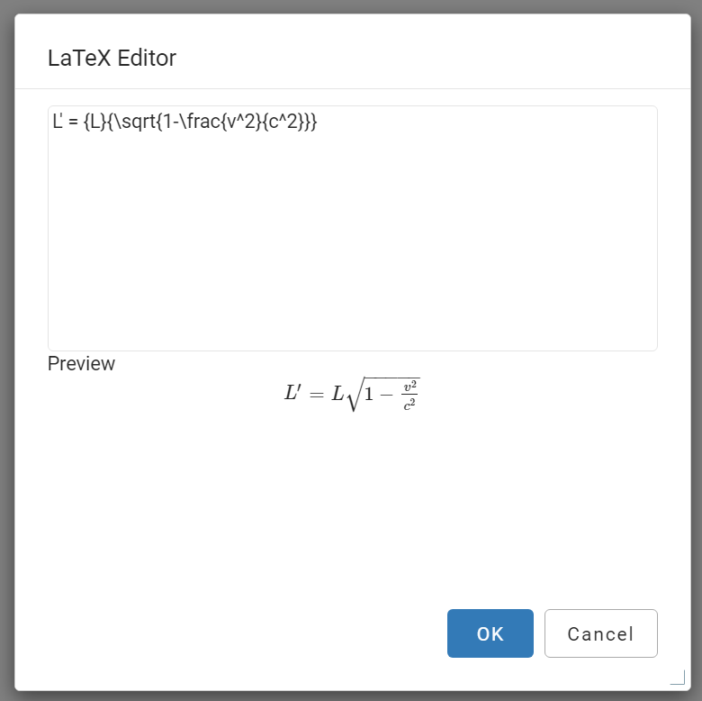

Web Author LaTeX Plugin (Experimental)
======================================

An experimenal Web Author plugin that provides rendering and editing support for embedded Latex equations.

Installation
------------

- Make sure you have Apache Maven installed.
- Run `mvn package` in the project's root folder. The plugin will be available in the `target` folder, with a name ending with `-plugin.jar`
- Use the Adiministration Page of Web Author to upload the plugin
- Restart the Web Author server

Usage
-----

The rendering support is implemented as a custom form control with the renderer class `com.oxygenxml.webapp.latex.WebappLatexRenderer`. 

By default it is added on DITA `foreign` element which has the `outputclass="latex"` or `outputclass="embed-latex"` attribute.

To add it on another element you can add a CSS rule in your framework that is similar to the one below:

```
  my-latex-element {
    visibility: -oxy-collapse-text;
    content: oxy_editor(
        webappRendererClassName, "com.oxygenxml.webapp.latex.WebappLatexRenderer"
        edit, "custom");
  }
```

To edit the equation the user needs to double-click the equation:



MathJax
-------

This project is based on MathJax 2.6. To keep the size within reasonable limits we removed:

- image fonts: `fonts/HTML-CSS/TeX/png/`
- context menu localization (we disable it anyway): `localization/`
- development files: `unpackaged/`
- configuration files - we use our own: `config/`
- support for SVG outout - we use HTML: `jax/output/SVG/`
- all fonts besides TeX and STIX-Web: `fonts/HTML-CSS/...`

Copyright and License
---------------------
Copyright 2022 Syncro Soft SRL.

This project is licensed under [Apache License 2.0](https://github.com/oxygenxml/web-author-mathml-plugin/blob/master/LICENSE)
